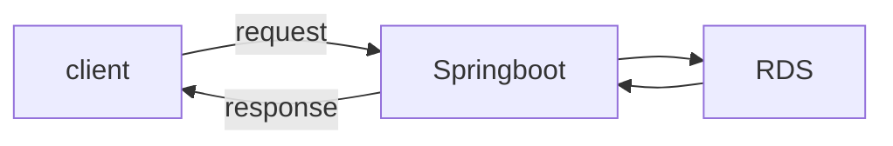

## 프로젝트 소개
롯데 헬스케어 과제전형관련

**좌석 예약 시스템** **api** **개발** 레포지토리 입니다.
 

## Stack
- kotlin
- springboot 3.1.2
- gradle 8.2.1
- MySQL 8.0.3 (AWS RDS)
- Spring Data JPA

## 프로젝트 설계

### Architecture


### schema
|employee|seat|reservation
|--|--|--|
| id|id|id|
| employee_num|seat_num|seat_id|
| work_type|created_at|employee_id|
| created_at|updated_at|reserved|
| updated_at||created_at|
| ||updated_at

### 요구사항 구현 설계
- reservation 테이블은 00시부터 24시, 24시간 기준으로 테이블을 초기화 합니다.

- 구현 내용에 적힌 3개의 API 만을 고려하기 보단 확장이 용이하도록 스키마를 3개로 구성했습니다.

- 좌석이 모두 예약되는 경우, 예약하지 못한 직원은 자동으로 재택근무 형태가 지정됩니다.
	- 직원이 좌석 요청을 보낼 경우, 만약 좌석 100개가 모두 예약 되어 있으면 자동으로 재택근무 형태로 저장되도록 구현했습니다.
	- 만약 좌석100개가 모두 예약 될때마다 좌석을 지정하지 않은 직원들을 체크 해서 재택근무 형태로 지정되도록 구현하는 방법을 고려 했었지만 좌석이 취소 될 때마다 조회 쿼리가 발생할 수 밖에 없고 예약/재택/휴가 셋다 선택을 안한 사람도 있는지 확인해야 할 필요가 있으니 비효율적이라고 판단했습니다.
- 동일한 좌석은 하루에 1번만 예약이 가능합니다 + 여러 직원이 동시에 같은 좌석을 예약할 수 없습니다.
	- 이 요구사항을 구현하기 위해서 reservation 테이블에 reserved라는 칼럼을 추가해서 관리할 수 있도록 구현 했습니다.


## Download
```
$ git clone https://github.com/Resilient923/lotte-reservation-api.git
```

## Build

```
cd {project_dir}
```

```
./gradlew build
```

## Run
```
cd {project_dir}/build/libs
```
```
java -jar api-0.0.1-SNAPSHOT.jar
```

## test
```
cd {project_dir}
```
```
./gradlew test
```

## API문서
Swagger를 사용한 API 문서화 진행했습니다.
Application 실행 후, 아래 url로 접속합니다.
```
http://localhost:8080/swagger-ui/index.html#/
```
